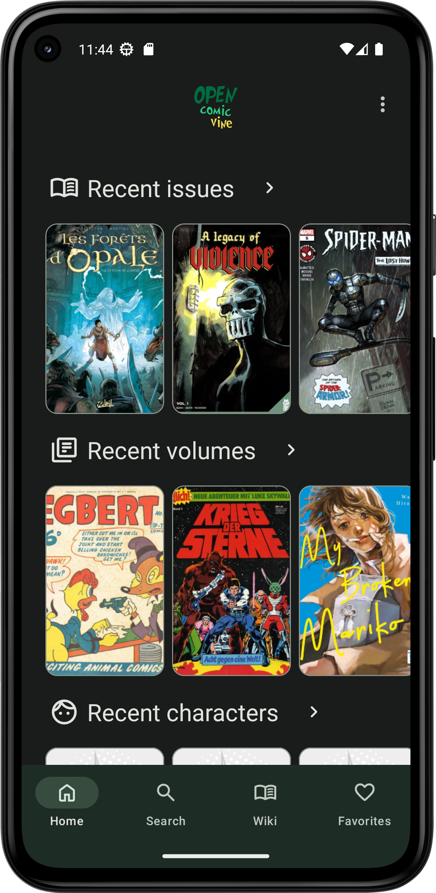

<h2><b>OpenComicVine</b></h2>
<h4>Comic Vine client for Android, website on comics.
</h4>

<h4>Comic Vine project: <a href="https://comicvine.gamespot.com">https://comicvine.gamespot.com</a>

----

## Screenshots

## 📋 Features

 - Free and Open Source software (FOSS)
 - Comic Vine Wiki
 - Viewing Comic Vine details of characters, issues, volumes and more
 - Recently added Comic Vine issues, characters and more
 - Search
 - Favorites
 - Material 3 Design
 - Night theme
 - Responsive UI for different devices form factors

 ## 🌍 Translations

 - **English**
 - **Russian**

## 💰 Donation

If you like OpenComicVine you can support developer with these methods. If you have problems with payment or you want to donate in another way, contact me: `proninyaroslav@mail.ru`. Thank you!

 - **Bitcoin**: `12isaLkH8nZ4DkFguVFeYrGHqQi7EEgUrM `
 - **Yandex Money (YooMoney)**: `410011738561939`
 - **WebMoney**:
     - **WMZ**: `Z335461926163`
     - **WMR**: `R151579576467`
 - **Amazon.com eGift Cards**: just choose your amount and type e-mail `proninyaroslav@mail.ru`
in the gift card details https://smile.amazon.com/gp/product/B004LLIKVU/
 - **Liberapay**: 

## 🎉 Contributing

Please see [CONTRIBUTING.md](CONTRIBUTING.md)

#### Developers

* [Yaroslav Pronin](https://github.com/proninyaroslav)

## 🔒 Privacy Policy

Please see our [Privacy Policy](PRIVACY.md).

## 📄 License

    Copyright (C) 2023 Yaroslav Pronin <proninyaroslav@mail.ru>
    This file is part of OpenComicVine.
    OpenComicVine is free software: you can redistribute it and/or modify
    it under the terms of the GNU General Public License as published by
    the Free Software Foundation, either version 3 of the License, or
    (at your option) any later version.
    This program is distributed in the hope that it will be useful,
    but WITHOUT ANY WARRANTY; without even the implied warranty of
    MERCHANTABILITY or FITNESS FOR A PARTICULAR PURPOSE.  See the
    GNU General Public License for more details.
    You should have received a copy of the GNU General Public License
    along with this program.  If not, see <http://www.gnu.org/licenses/>.
